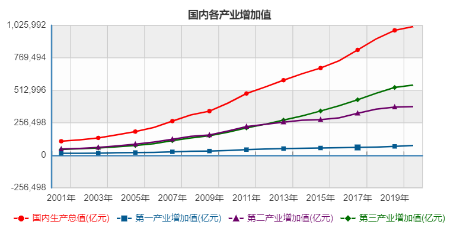
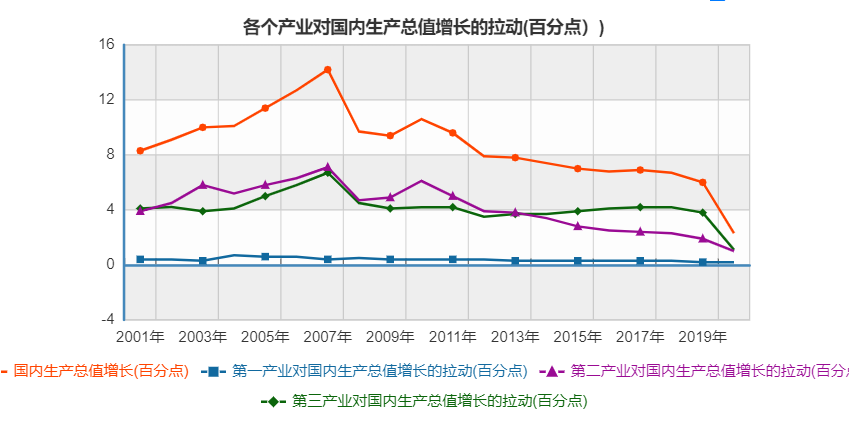
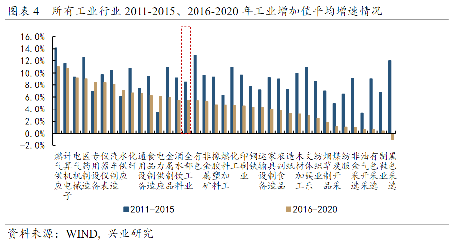
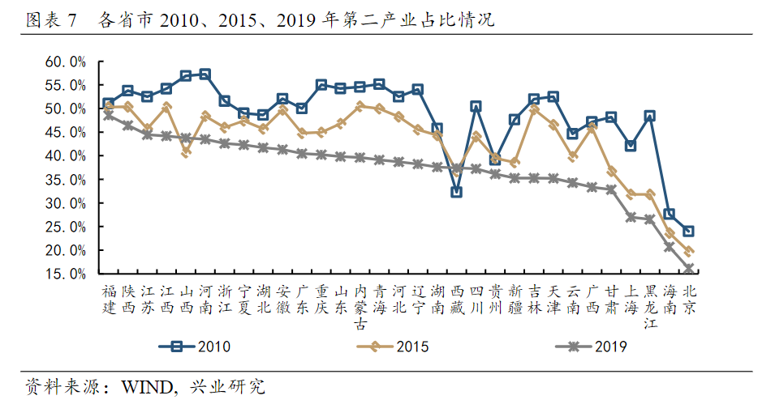
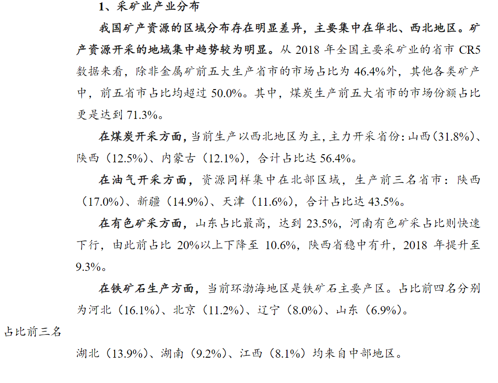
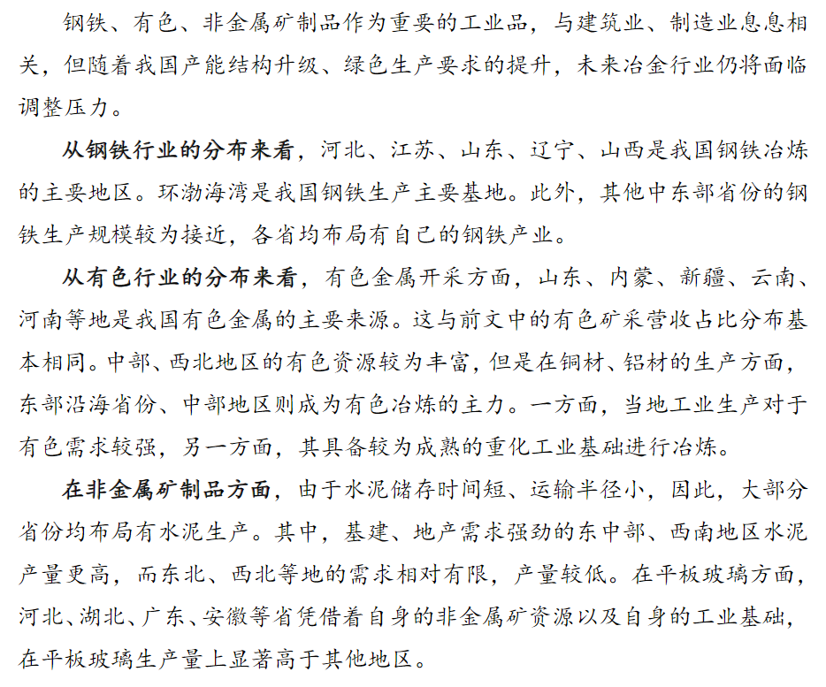
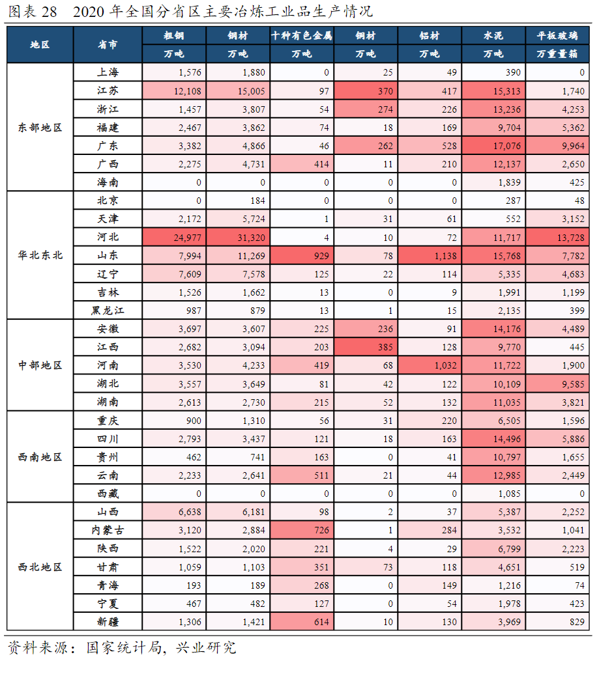
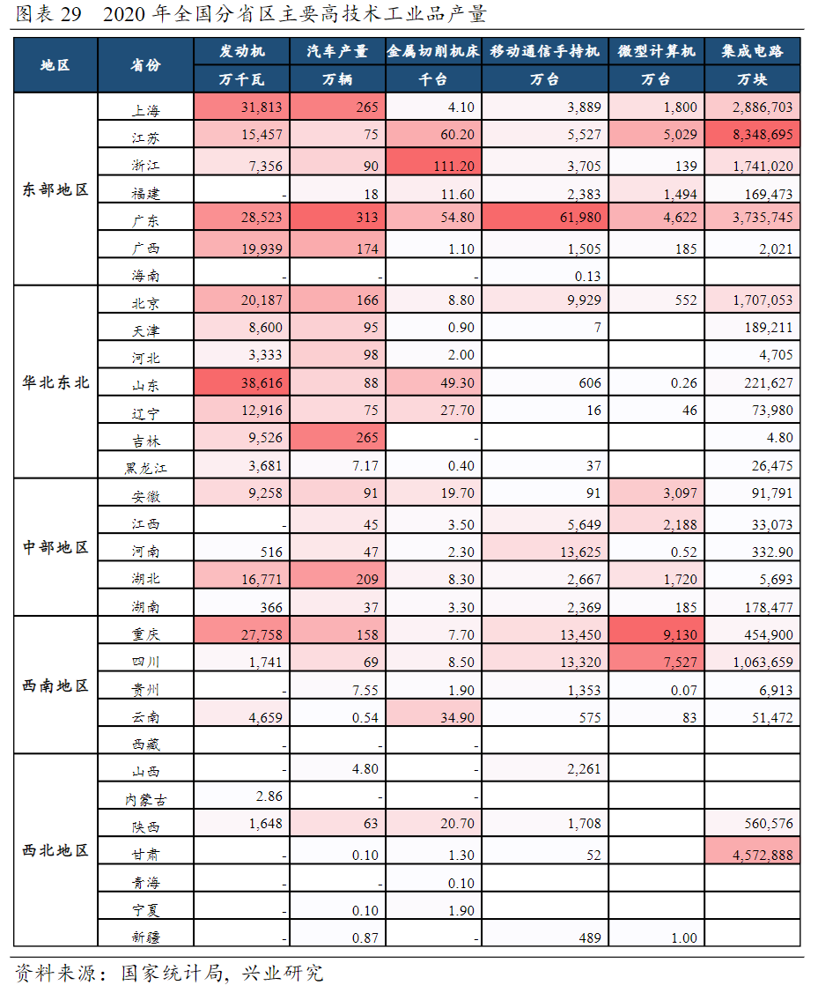
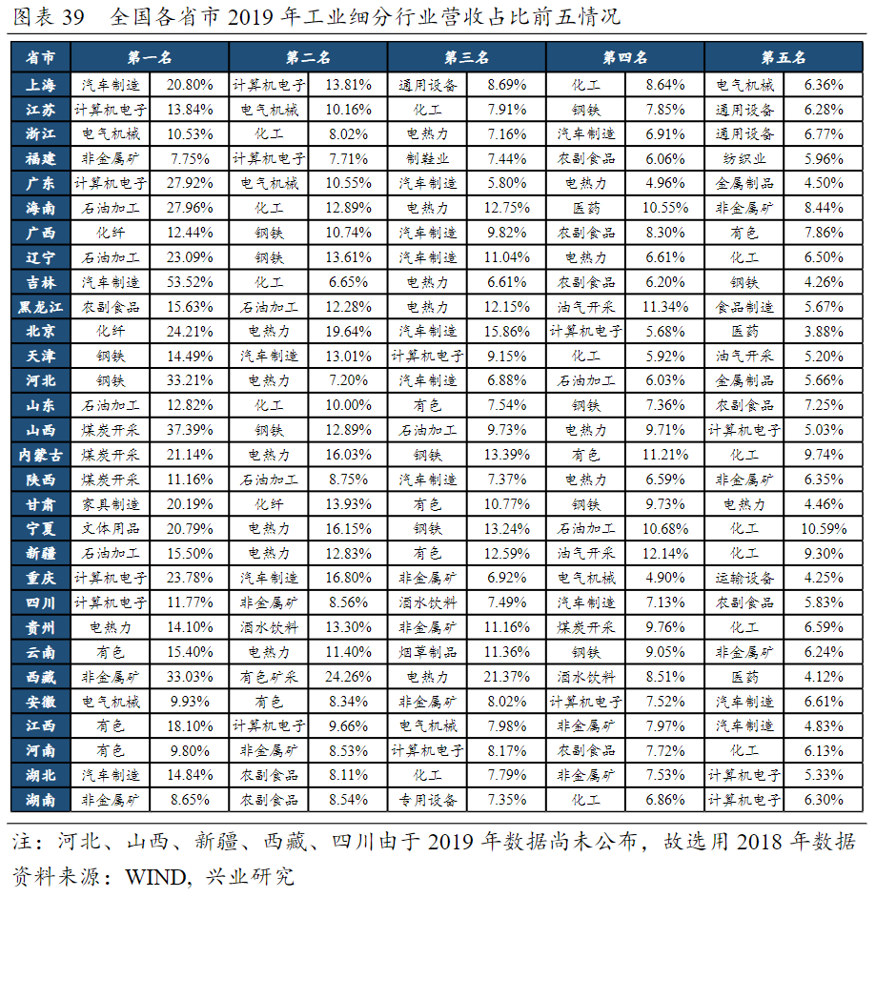

- 全国产业结构
2013年第三产业的GDP占比首次超过了第二产业，并此后一直领先于第二产业。
  
  
统计解释：第一产业对国内生产总值增长的拉动是指GDP增长速度与第一产业贡献率之乘积。按不变价格计算。二三产业一样。     
第一产业增加值是指按市场价格计算的一个国家（或地区）所有常住单位在一定时期内从事第一产业生产活动的最终成果。第一产业是指农、林、牧、渔业（不含农、林、牧、渔服务业）。    
第二产业增加值是指按市场价格计算的一个国家（或地区）所有常住单位在一定时期内从事第二产业生产活动的最终成果。第二产业是指采矿业（不含开采辅助活动），制造业（不含金属制品、机械和设备修理业），电力、热力、燃气及水生产和供应业，建筑业。    
第三产业增加值是指按市场价格计算的一个国家（或地区）所有常住单位在一定时期内从事第三产业生产活动的最终成果。第三产业是指除第一、二产业以外的其他行业。    
*资料来源：国家统计局*
  
*资料来源：《中国产业地图》*

- 产业调整政策：
1. 供给侧改革    
供给侧结构性改革是中华人民共和国一项经济政策，由中共中央总书记习近平于2015年11月在中央财经领导小组第十一次会议上提出，内容包括“去产能、去库存、去杠杆、降成本、补短板”，又称“三去一降一补”，以及降低赋税，关闭煤炭、钢铁、水泥等产能过剩工厂，严格控制产能过剩行业的信贷和补贴。而在此前2015年10月，中央财经办公室主任刘鹤在广东调研时已提出类似概念，指出要重视“供给侧调整”，加快淘汰“僵尸企业”，化解过剩产能。    
2008年金融危机之下，时任中华人民共和国国务院总理温家宝力主推动四万亿投资计划，自此导致相关产能严重过剩，例如中国钢铁产量已达日本、印度、美国和俄罗斯总产量的两倍以上。供给侧结构性改革正是在此背景下提出。    
[资料来源：供给侧改革](https://zh.wikipedia.org/wiki/%E4%BE%9B%E7%B5%A6%E5%81%B4%E7%B5%90%E6%A7%8B%E6%80%A7%E6%94%B9%E9%9D%A9)
2. [国家产业调整目录](http://www.gov.cn/xinwen/2019-11/06/content_5449193.htm)
3. [鼓励外商投资产业目录（2020年版）](http://www.gov.cn/zhengce/zhengceku/2020-12/28/content_5574265.htm)
4. [西部地区鼓励类产业目录（2020年本）](http://www.gov.cn/gongbao/content/2021/content_5598119.htm)

- 工业在各省份的分布情况   
各省市第二产业占比情况
  
*资料来源：《中国产业地图》*
1. 采矿业
  
*资料来源：《中国产业地图》*
2. 重化工产业分布
从重化工业的产业分布情况来看，江苏、山东、广东、浙江等东部贸易、工业大省，重化工业产业布局更为全面，占比较高。其中，江苏在所有重化工业产业中，营收占比均列入前五。     
对于与下游消费品联系更为紧密的化工、化纤、橡胶塑料、金属制品等行业中，江苏、浙江、广东等省份由于离市场更近，对产业控制力更强。    
而炼油、钢铁、金属制品等领域，渤海湾地区的山东、河北、辽宁、天津具备一定的资源优势与工业基础，营收占比靠前。     
3. 冶金业
  
*资料来源：《中国产业地图》*
  
*资料来源：《中国产业地图》*
4. 汽车和装备制造业    
在汽车工业方面，广东、上海、吉林、北京、湖北、广西、重庆等地是我国汽车主要生产地区。这些省市往往有着一批合资车企，在汽车生产方面有着较长的发展历史。整车生产能力较强的地区，其发动机产量亦相对更高。汽车产业链的整体发展，既有利于整车企业，同时亦能够推动配套零部件产业的发展。    
在装备制造业和电子产业方面，长三角、珠三角地区有着绝对的优势。从全国金属切削机床的生产来看，生产高度集中在江浙粤。此外，山东和辽宁工业基础较强，产业发展历史悠久，亦有着较强的装备制造基础。    
值得注意的是，甘肃在集成电路领域异军突起，2020年其集成电路产量占比达到17.5%。当前，甘肃的华天科技、天光半导体等企业在半导体封装测试领域均已位居全球前列，地区初步形成集成电路产业链，拥有集成电路设计、生产、封测能力。    
  
*资料来源：《中国产业地图》*

- 各省市营收前五行业
  
*资料来源：《中国产业地图》*

- 各省市统计年鉴
1. [黑龙江](http://tjj.hlj.gov.cn/app/tongjnj/2020/zk/indexch.htm)
2. [江苏](http://tj.jiangsu.gov.cn/col/col80733/index.html)
3. [吉林](http://tjj.jl.gov.cn/tjsj/tjnj/index.html)
4. [辽宁](http://tjj.ln.gov.cn/tjsj/sjcx/ndsj/)
5. [北京](http://nj.tjj.beijing.gov.cn/nj/main/2020-tjnj/zk/indexch.htm)
6. [天津](http://stats.tj.gov.cn/tjsj_52032/tjnj/)
7. [河北](http://tjj.hebei.gov.cn/hetj/tjsj/jjnj/)
8. [山东](http://tjj.shandong.gov.cn/col/col6279/index.html)
9. [山西](http://tjj.shanxi.gov.cn/tjsj/tjnj/)
10. [河南](http://www.ha.stats.gov.cn/tjfw/tjcbw/tjnj/)
11. [安徽](http://tjj.ah.gov.cn/ssah/qwfbjd/tjnj/index.html)
12. [浙江](https://tjj.zj.gov.cn/col/col1525563/index.html)
13. [上海](http://tjj.sh.gov.cn/tjnj/index.html)
14. [江西](http://tjj.jiangxi.gov.cn/col/col38595/index.html)
15. [福建](https://tjj.fujian.gov.cn/xxgk/ndsj/)
16. [广东](http://stats.gd.gov.cn/gdtjnj/)
17. [广西](http://tjj.gxzf.gov.cn/tjsj/tjnj/)
18. [澳门](https://www.dsec.gov.mo/zh-CN/Home/Publication/YearbookOfStatistics)
19. [香港](https://www.censtatd.gov.hk/tc/EIndexbySubject.html?pcode=B1010003&scode=460)
20. [云南](http://stats.yn.gov.cn/tjsj/tjnj/)
21. [贵州](http://stjj.guizhou.gov.cn/tjsj_35719/sjcx_35720/gztjnj_40112/)
22. [重庆](http://tjj.cq.gov.cn/zwgk_233/tjnj/)
23. [湖南](http://tjj.hunan.gov.cn/tjsj/tjnj/)
24. [湖北](http://tjj.hubei.gov.cn/tjsj/sjkscx/tjnj/qstjnj/)
25. [陕西](http://tjj.shaanxi.gov.cn/tjsj/ndsj/tjnj/)
26. [海南](http://stats.hainan.gov.cn/tjj/tjsu/ndsj/)
27. [宁夏](http://nxdata.com.cn/publish.htm?cn=G01)
28. [内蒙古](http://tj.nmg.gov.cn/tjyw/jpsj/)
29. [甘肃](http://tjj.gansu.gov.cn/tjj/c109464/info_disp.shtml)
30. [青海]()
31. [新疆](https://tjj.xinjiang.gov.cn/tjj/tjgn/ist.shtml)
32. [西藏](http://tjj.xizang.gov.cn/xxgk/tjxx/tjgb/)
33. [四川](http://tjj.sc.gov.cn/scstjj/c105855/nj.shtml)
34. [台湾](https://www1.stat.gov.tw/lp.asp?CtNode=2706&CtUnit=1049&BaseDSD=34&mp=3)

