### 煤
- 煤的分类    
1. 按照煤化作用分：    
根据干燥无灰基挥发分等指标，将煤炭分为无烟煤、烟煤和褐煤，其中无烟煤煤化程度最高，烟煤次之，褐煤煤化程度最低；再根据干燥无灰基挥发分及粘结指数等指标，将烟煤划分为贫煤、贫瘦煤、瘦煤、焦煤、肥煤、1/3焦煤、气肥煤、气煤、1/2中粘煤、弱粘煤、不粘煤及长焰煤。煤种间的区分较复杂，涉及多个指标。    
2. 按照用途划分：    
根据煤炭用途可分为动力用煤、炼焦用煤和化工用煤，其中传统的化工用煤一般为无烟煤。    
按用途分，除动力用煤、炼焦用煤和化工用煤外，喷吹煤亦是一类重要用煤。喷吹煤主要为钢铁冶炼时用于高炉喷吹的煤炭，替代一部分焦炭的需求，起到加热、降低钢铁冶炼成本的作用，主要由无烟煤洗选而得；由于烟煤挥发分高、着火点低，易于燃烧，且密度较无烟煤小，输煤时可提高输送效率，部分烟煤也可经磨制生产喷吹煤，但由于烟煤挥发分高，有自爆、易燃特性，对设施要求更高。    
[资料来源：煤炭全论 ](https://www.sohu.com/a/196616707_784844)    
*中国煤炭分类标准（GBT5751——2009）*    

- 煤与其应用：
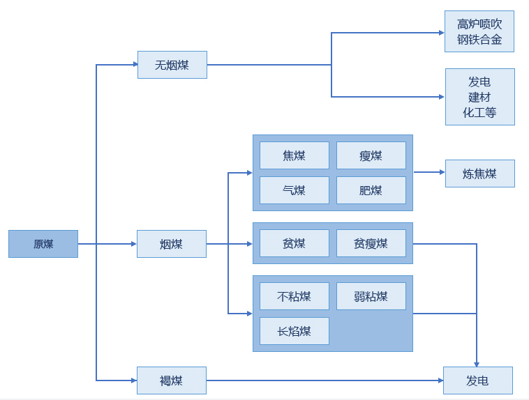  
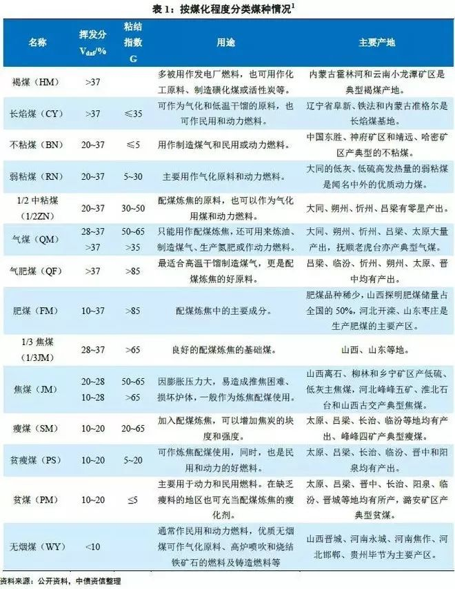  
[资料来源：煤炭全论 ](https://www.sohu.com/a/196616707_784844)    

- 煤的下游需求消耗情况：   
我国煤炭消费主要用于电力、钢铁、化工和建材四大行业，其中电力行业的消费占比一直在50%以上。    
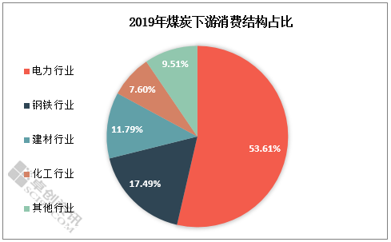  
[资料来源：电力行业耗煤量同比下滑 2020年煤炭价格重心下移](https://finance.sina.com.cn/money/future/indu/2020-08-10/doc-iivhuipn7888564.shtml)

- 煤的开采流程：    
[煤的开采流程视频(露天)](https://www.youtube.com/watch?v=AOJMinVOVeg&ab_channel=%D0%A3%D0%93%D0%9C%D0%9A)

- 煤的储量情况：   
截至2020年底，全球已探明的煤储量为10741.1亿吨，其中无烟煤和烟煤为7536.4亿吨，次烟煤和褐煤为3204.7亿吨。从储量分布来看，煤资源的42.8%分布在亚太地区，23.9%在北美洲，17.8%在独联体，12.8%在欧洲。从国别来看，美国储量最多，占全球资源的23.2%，俄罗斯占15.1%，澳大利亚占14.0%，中国占13.3%，印度占10.3%，前五个国家储量之和占全世界的75.9%。     

- 我国煤资源的储蓄情况：    
我国含煤面积为55万平方公里，其中深度1000米以浅的煤炭储量2.86万亿吨。山西省焦煤查明资源储量1694.6亿吨，占全国焦煤查明储量61.4%；山西省焦煤可采储量331.6 亿吨，占全国可采储量51.3%，山西省焦煤可采储量和查明资源储量均位居全国首位。焦煤查明资源储量占全国第二、三、四、五位的分别是安徽省236.2 亿吨、山东省172.7 亿吨、贵州省98.6 亿吨、黑龙江省98.2 亿吨。    

- 不同煤种的储蓄量占比：
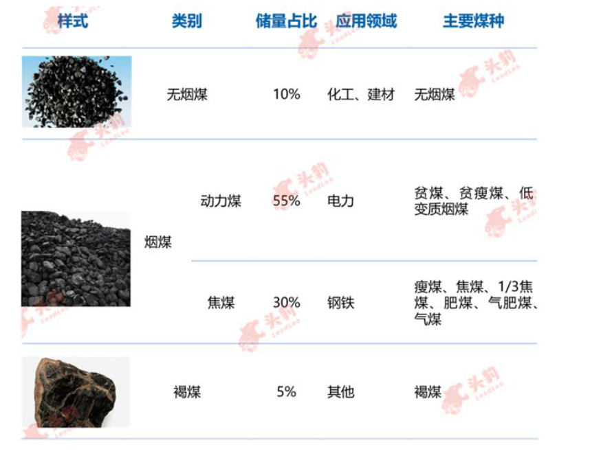  

- 炼钢的主要燃料————焦煤：    
焦煤也称冶金煤，又名主焦煤。黑色，玻璃光泽，贝壳状或平整状断口，致密而脆。条痕灰黑色，含碳80%~85%，氢4%~5%。氧5%~10%。发热量8000~8500% Kcal/Kg。挥发物约为14%~30%，胶质层厚度约为8~25mm。是中等及低挥发分的中等粘结性及强粘粘结性的一种烟煤，焦煤在中国煤炭分类国际标准中，是对煤化度较高，结焦性好的烟煤的称谓。    
焦煤是中等变质烟煤。由于粘结性强，能炼出强度大、块度大、强度高、裂纹少的优质焦碳，是炼焦的最好原料。其联接着煤、焦、钢三个产业，在产业链条上具有重要的地位。能用于期货交割的焦煤必须是经过洗煤厂洗选后的精煤，并且利用镜质体发射率标准差指标来严格限定为单一煤种，同时利用小焦炉实验手段确保其具有足够的结焦性。
炼焦煤的原煤煤种：焦煤、瘦煤、气煤、肥煤。

- 焦煤生产流程：    
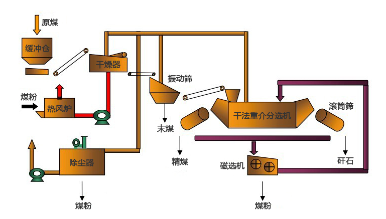  

- 我国焦煤主要产地：
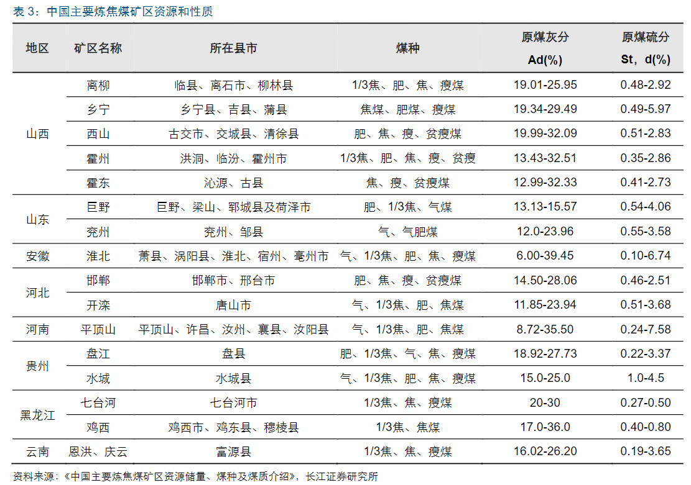  

- 焦煤在炼钢环节中的能耗占比：    
1. 高炉-转炉流程生产工艺的能源投入有大约89%来自煤，7%来自电，5%来自天然气，1%来自其他气体。
2. 电弧炉生产工艺的能源投入，其中11%来自煤，50%来自电，38%来自天然气以及1%来自其他气体。    
*资料来源：《钢铁业的能源利用》*    

- 炼钢的主要燃料——————焦炭：    
焦炭亦称“焦块”、“焦渣”。呈银灰色，具金属光泽,质硬而多孔.。由煤在锅炉炉内加热到850℃以上时，随着温度升高，煤中的有机物分解， 其中挥发性产物逸出后， 残留下的不挥发产物就是焦炭。其中包括能燃烧的固定碳和燃烧残余物——灰分。燃烧时发出很短的蓝色火焰，并释放大量热量。燃烧过程缓慢而持久，且易在表面形成灰壳。为使焦炭燃尽，应设法及时除去其灰壳。焦炭的物理性质(如粘结性等)，对于层燃炉的运行具有较大的影响。    
焦炭产量约占焦化产品的75%左右。焦炭主要用于炼铁，它在生铁生产成本中约占1/2～1/3。高炉冶炼过程实际上是将铁矿石还原的过程， 焦炭即充当了还原剂和热量来源。
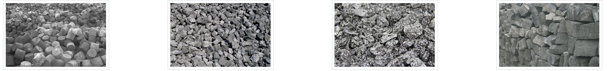  

- 焦炭生产流程：
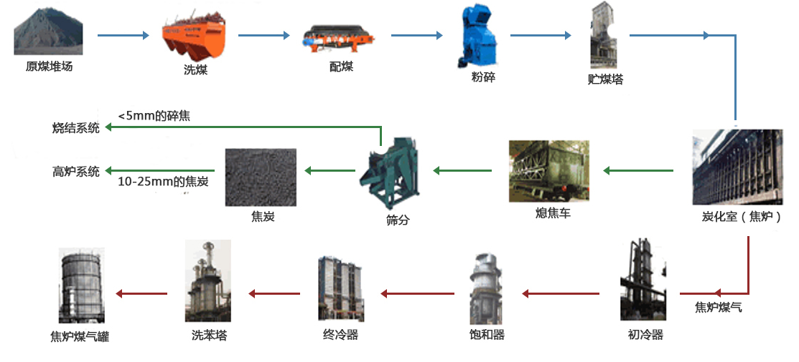  

- 焦炭分类：
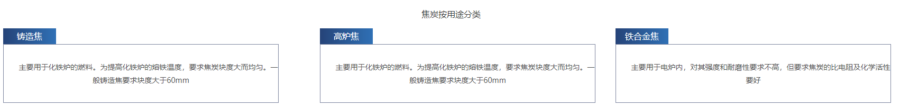  

- 焦煤与焦炭的关系：    
生产1 吨焦炭需消耗1.33 吨炼焦煤，其中主焦煤和肥煤用量占比通常在50-60%。
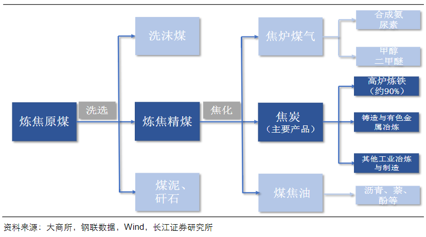
*资料来源：《一文读懂炼焦煤》*
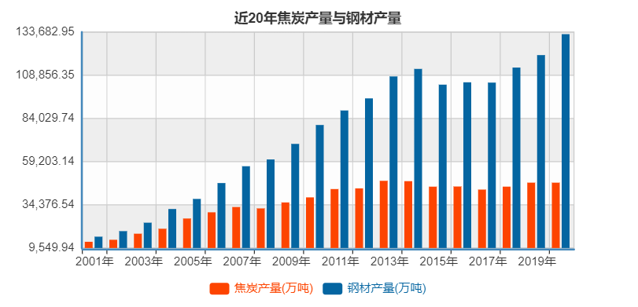  
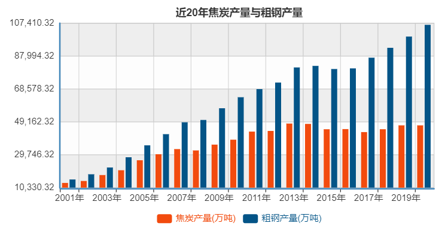  
*资料来源：国家统计局*
- 各省市焦炭产量情况：
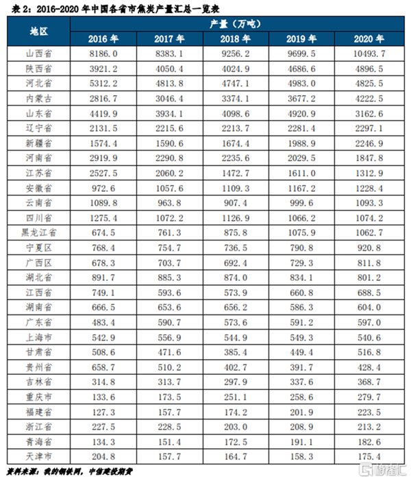  
[资料来源：暴涨的煤炭、双焦背后真实的供需面](http://www.hxny.com/nd-59860-0-17.html)    

- 煤的期货市场：    
1. 我国：2013年9月26日，动力煤期货在郑州商品交易所上市。
2. 美国：纽约商业交易所(NYMEX) 2001年7月12日上市了中部阿巴拉契(CAPP)煤炭期货。
3. 欧洲：洲际交易所(ICE)，2006年7月引入了针对欧洲市场的两种煤炭期货合约。
4. 澳大利亚：澳大利亚证券交易所(ASX)计划2009年引入煤炭、天然气和可再生能源的期货合约。   
[资料来源：国际煤炭期货发展情况分析](https://www.china5e.com/m/news/news-94414-1.html)

- 煤炭运输方式及价格：   
铁路和公路为最主要的两种煤炭运输方式，且占比相近（约40%~45%）煤炭省内销售由于运距较近，因此采用公路为主（占比73%）；煤炭省间销售的情形下，由于运距较远，多采用铁路运输（占比56%）和水路运输（占比30%）的方式。
1. 运输方式：    
煤炭的运输方式包括铁路、水路和公路，或单方式直达运输，或铁路、公路、水路多式联运。   
由于受煤炭生产与消费格局的影响，中国煤炭的基本流向是"北煤南运 "，"西煤东运"和"煤炭出关"。省际煤炭交流中，南北向煤炭流占75%，东西向煤炭流占25%。其中南下煤炭流占50%以上，北上煤炭流占20%左右，东向煤炭流占20%左右，西向煤炭流仅占5%左右。山西是最大的煤炭输出省，其输出量占全国省际煤炭流量的45%。   
2. 铁路运输线路：   
北路：包括丰台沙城大同、大秦线西段（大同--大石庄，约全国铁路煤炭总运量的1/6左右）、京原（北京--原平）、京秦（北京--秦皇岛）铁路。   
中路：包括太原-石家庄-德州铁路。其主要输出山西省晋中、阳泉、汾西及河北省井陉煤炭。    
南路：包括南同蒲、太原-焦作铁路。其主要输出晋南和晋东南的煤炭，输出煤炭3000多万吨，主要供应华东、华中、华南等地。    
南北：京广铁路，主要接纳中路和南路的煤炭及河南的煤，输送到湖南、湖北、广东等省，一部分经长江港口输到下游沿岸地区。   
西北：西北通道包括陇海、兰新铁路和包兰铁路等。    
西南：西北入川包括宝成、襄渝铁路，陕西的煤供应四川。南部入川包括成昆、贵昆铁路，贵州煤炭供应四川的攀枝花等地。    
[资料来源：煤的运输](https://baike.baidu.com/item/%E7%85%A4%E7%82%AD%E8%BF%90%E8%BE%93/10352663)    
*《我国煤炭运输通道及运费研究》*

- 煤定价    
  影响煤定价因素：    
  1. 政策限制开采，煤价上涨
  2. 天然气等其他清洁能源的利用技术提升
  3. 由于大部分煤资源集中在北方，煤的价格对比较南方的钢厂影响可能会减弱。
  4. 铁路对煤炭的运输价格政策调整。
  5. 其他意外因素，如煤矿安全事故需要安全整顿，煤矿供应紧张，煤炭价格上涨。
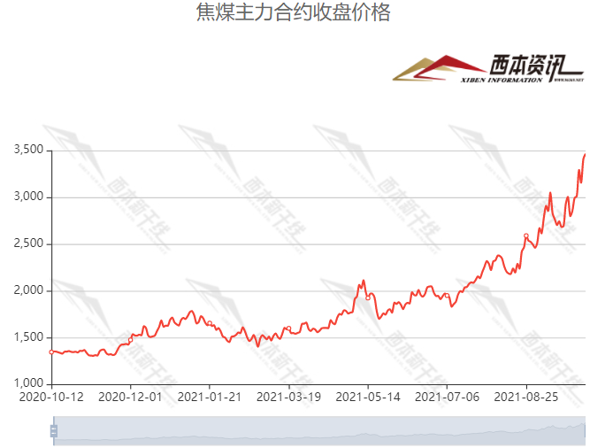  
