### 钢材
- 钢的定义：    
以铁为主要元素、含碳量一般在2%以下，并含有其他元素的材料。（在铬钢中含碳量可能大于2%，但2%通常是钢和铸铁的分界线）。

- 钢材分类与品种：    
1. 依据化学性质分，可以分为：非合金钢、低合金钢、合金钢。这三种分类方式主要依据钢中的其他元素的含量不同而区分。
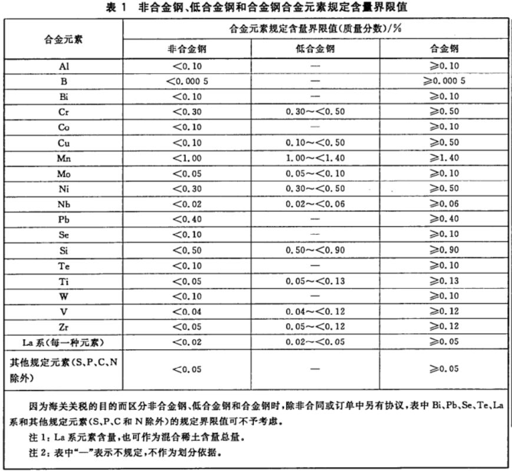  
[资料来源：《钢分类》GB/T 13304.1-2008](https://www.wdfxw.net/doc54774672.htm)
2. 依据外形分：长材、扁平材、管材。     
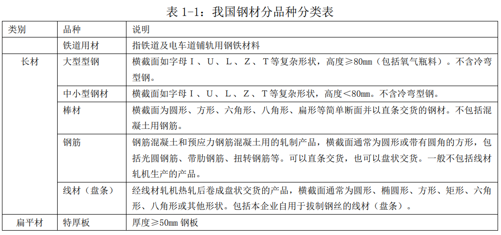  
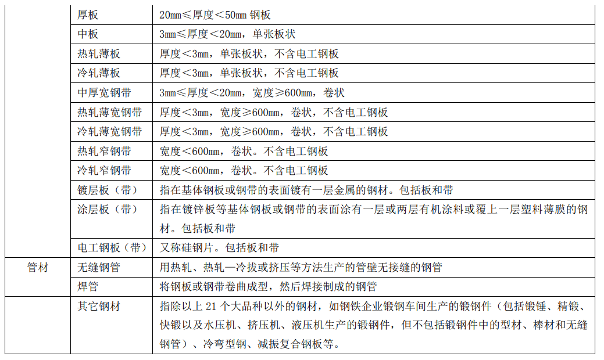  
 *资料来源：上海期货交易所《钢材基础知识与市场概况》*    
3. 在外形的基础上，按照钢材用途分：
 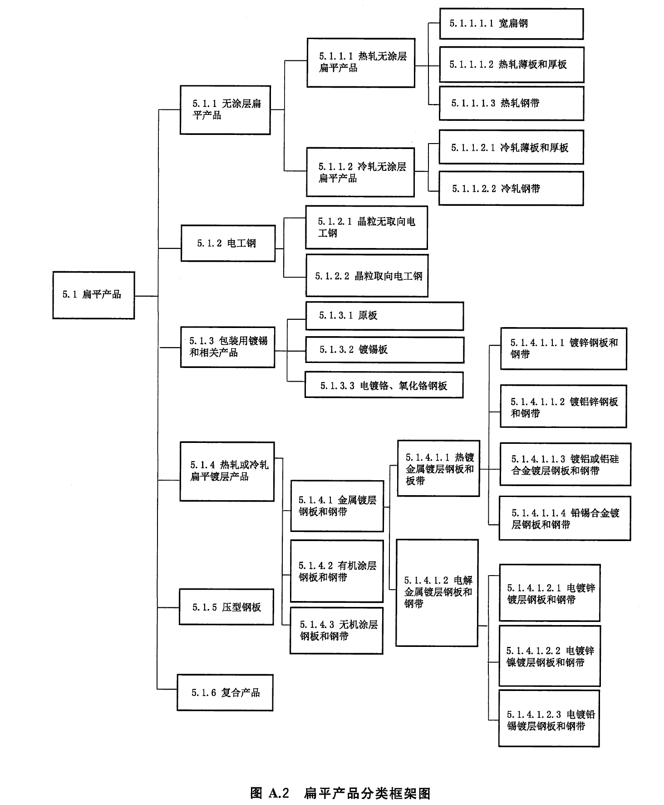  
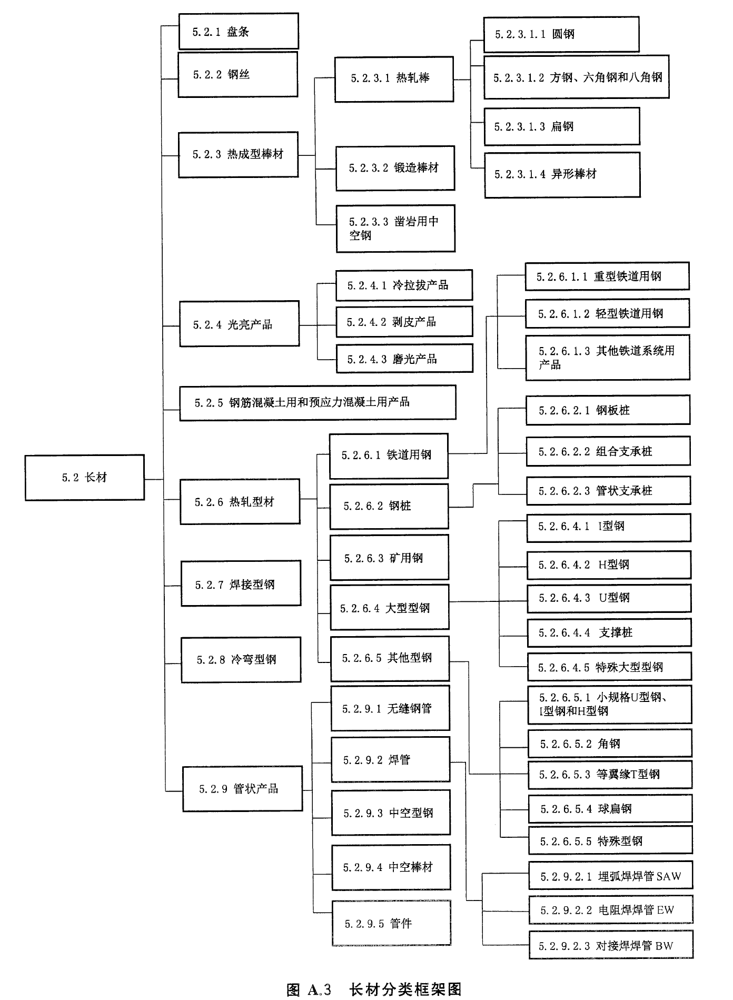  
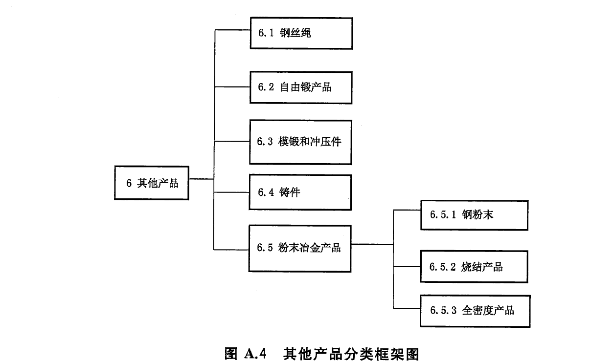  
*资料来源：《GB/T 15574一2016钢产品分类》*    
[按形状分类补充材料](http://www.360doc.com/content/20/0108/21/36632215_885092179.shtml)

- 炼钢流程：    

1. 炼钢的过程：    
用氧化方法去除生铁和废钢中的杂质，加入适量的合金元素，使之成为具有高的强度、韧性或其他特殊性能的钢，这一工艺过程称为“炼钢”。     
炼钢中需要去除的元素包括：多余的碳、硫、磷、氧；根据需要炼制的钢材不同可以加入不同的合金元素包括V、Cr、Ni、Ti、Cu等，各元素的具体含量标准可以参考国家标准、企业标准、其他国家标准等。     
目前炼钢的流程有两种，高炉炼钢与电炉炼钢。高炉炼钢主要以铁矿石为原料，通过焦煤、焦炭等燃料辅助燃烧炼成铁水，铸造成钢坯，最后轧制成成品钢材。电炉炼钢则是废钢为主要原料，以电作为热能源，将废钢等原料融化炼制成钢材。   

2. 高炉、电炉炼钢流程图
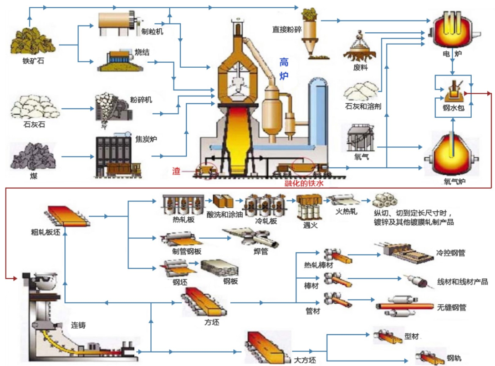
 
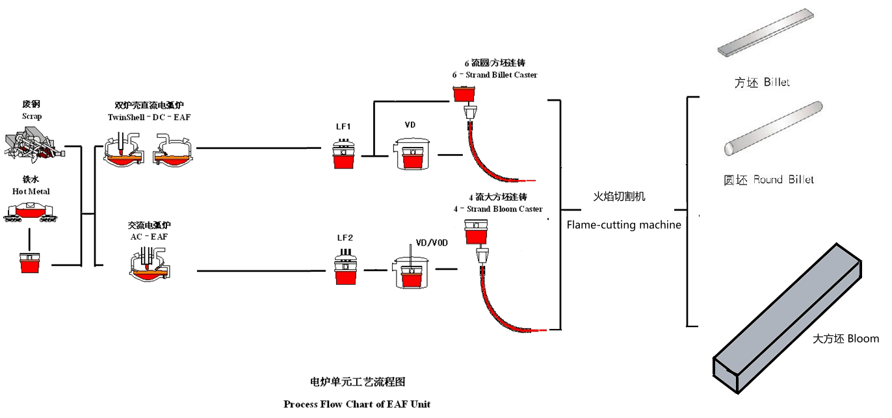  

3. 炼钢流程视频：    
[宝武钢铁生产视频](https://www.bilibili.com/video/BV1t4411M7VK/?spm_id_from=333.788.recommend_more_video.13)    
[英国康力思钢铁生产视频](https://www.bilibili.com/video/BV1HT4y1E7Ew)

4. 炼钢流程详细介绍：    
[炼钢流程文字版介绍](https://www.sohu.com/a/430373841_466870)    
    
- 钢厂炼钢成本：    
1. 钢铁企业产品成本项目主要包括：    
（一）原料及主要材料费，是指为生产产品直接投入的构成0产品实体的物料费用。原料及主要材料费主要包括投入的铁矿石、铁水、生铁块、废钢、铁合金、钢坯、钢锭、用于再加工的钢材、锌、锡、有机涂料等成本。      
（二）辅助材料费，是指为生产产品投入的辅助材料的成本。 辅助材料费主要包括投入的皮带、耐火材料、熔剂、电极、轧辊、酸碱类、油脂类、包装材料等成本。    
（三）燃料和动力费，是指为生产产品耗用燃料和动力发生的费用。燃料和动力费主要包括耗用的煤炭、焦炭、助燃剂，以及风、水、电、气等费用。     
（四）人工费，是指为生产产品向职工提供的各种形式的报酬及各项附加费用。人工费主要包括职工工资及各项津贴、福利费、工会经费、职工教育经费、社会保险费、住房公积金、商业人身险、其他劳动保险及劳务费等。     
（五）折旧费，是指为生产产品使用的生产装置、厂房、附属机器设备等计提的折旧。    
（六）运输费，是指为生产产品提供运输服务发生的费用。    
（七）维护及修理费，是指为维持产品生产的正常运行，保证设施设备原有的生产能力，对设施设备进行维护、修理所发生的费用。维护及修理费主要包括材料费、修理工时费、备品备件费等。    
（八）财产保险费，是指为组织产品生产管理，向社会保险机构或其他机构投保的各项财产所支付的保险费用。    
（九）办公费，是指为组织产品生产管理，发生的文具费、邮电费、通讯费、印刷费等办公性费用。    
（十）差旅费，是指为组织产品生产管理，职工因公出差所发生的住宿费、交通费、出差补助等。    
（十一）会议费，是指为组织产品生产管理，召开或参加会议发生的费用。    
（十二）外委业务费，是指在产品生产过程中，委托外部单位提供服务发生的费用。    
（十三）低值易耗品摊销，是指为组织产品生产管理，耗用的不能作为固定资产的各种用具物品的摊销。     
（十四）租赁费，是指为组织产品生产管理，租入的各种资产，按照合同或协议的约定支付给出租方的租赁费用。     
（十五）机物料消耗，是指在产品生产过程中耗用的未作为原材料、辅助材料或低值易耗品管理使用的一般性材料支出。    
（十六）劳动保护费，是指为生产产品为职工提供劳动保护、防护等发生的费用。    
（十七）排污费，是指为生产产品负担的排污机构处理废气、废水、废渣等所发生的费用。     
（十八）信息系统维护费，是指为组织产品生产管理，在计算机信息系统建设完成后所发生的运行维护费用。    
*资料来源:财政部《企业产品成本核算制度——钢铁行业》*

2. 钢材生产成本计算公式：    
以下计算公式均只能大致计算，不能准确计算钢材生产成本。依据生产技术、当年铁矿石的价格等因素影响，生产铁水所需铁矿石有可能上升至1.6t，或者废钢比例提高，铁矿石的需求量下降；由于焦炭、焦煤是生产环节中产生二氧化碳的主要来源，因此焦炭与焦煤的比例有可能依据环保技术的进步，降低使用量。    
钢材生产过程：原材料 → 铁水 → 粗钢 → 成品钢材    
> 1t铁水= 1.55t铁矿石+0.5t焦炭+0.13t喷吹煤+200人工费+烧结矿  
  1t粗钢= 0.95t铁水+0.15t废钢+0.02t铁合金+200人工费
  成品钢材成本= 粗钢+燃气、电能、轧辊损耗等耗费
  螺纹钢成本= 粗钢+150
  热轧板成本= 粗钢+300
  冷轧板成本= 粗钢+热轧板成本+650= 粗钢+950
  中厚板成本= 粗钢+400
 

3. 其他计算钢材成本的公式：    
> 生铁吨制造成本＝（1.6×铁矿石+0.45×焦炭）/0.9   
粗钢吨制造成本＝0.96×生铁/0.82   
钢坯生产成本= 矿石价格×1.6×1.13+焦炭价格×0.5+600挑费
普碳坯成本=铁水×1.1+其他费用约300    
炼铁成本=烧结矿×1.7+焦炭*0.5+其他费用250   

[资料来源：转炉炼钢成本: 铁矿石VS废钢](https://www.sohu.com/a/411185438_466870)    

> 1t生铁= 铁矿石1.55t + 焦炭340kg + 喷吹煤粉130kg + 烧结矿煤焦65kg+加工费     
1t粗钢= 0.96t生铁 + 140kg废钢 + 加工费    
螺纹、线材成本 =(1.03吨粗钢 + 压制费)×1.17

[资料来源：螺纹钢成本计算](https://finance.sina.com.cn/money/future/fmnews/2019-05-20/doc-ihvhiews3271179.shtml)

1. 减排政策对钢材生产成本的影响：    
根据我国的环保政策要求，未来必将严格控制钢铁行业的二氧化碳排放量。在减排政策下，钢企除了原材料等生产成本外还需要考虑两方面的减排成本：1、配额采购成本；2、技术改造成本。其中配额采购成本是指（钢企碳实际排放量-免费配额）*碳价格。钢企碳实际排放量包括企业边界内所有的化石燃料燃烧排放、工业生产过程排放以及企业净购入电力、净购入热力所隐含的碳排放之和，再扣除固碳产品隐含的排放。技术改造成本是指钢企为碳减排而进行的设备改造、原料配比改变等。    
根据研究发现，产生温室气体的主要是高炉炼钢。根据对西欧国家的炼钢工艺变化了解可知，通过对高炉添加CSS装置、顶部气体回收设备等进行碳回收，能够有效的减少温室气体排放。    
添加犹如CCS、顶部气体回收等设备进行碳回收，这就需要钢铁企业进行相应的固定资产投资，这部分投资反馈在炼钢成本中，占比一般在25%左右，假设原材料采购成本、人力成本以及其他成本都不变的情况下，炼钢成本将随着碳回收设备投资的增加而增加。    
**不同技术改造下的炼钢成本（单位：美元/吨）**
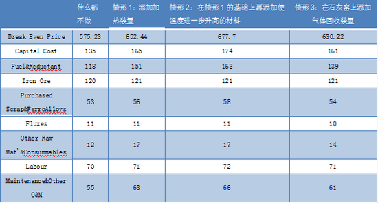  
[资料来源：南华期货](https://finance.sina.com.cn/money/future/roll/2021-09-06/doc-iktzqtyt4296891.shtml?cre=tianyi&mod=pcpager_fintoutiao&loc=14&r=0&rfunc=41&tj=cxvertical_pc_pager_spt&tr=174)   

### 钢厂
- 钢厂分布图    
1. [钢厂数量、产品、布局分布图（不可搜索）](http://www.steelhome.cn/ditu/ditu.php?pz=1)
2. [钢厂数量、产品、布局分布图（可搜索）](https://www.steelhome.cn/_v2app/mapditu.php?view=gcsearch)

### 资源采购模式    
对于炼钢所需的铁矿石、煤炭等资源，各大钢厂基本以向外采购为主，部分钢厂有焦炭厂。由于我国铁矿石品位不高等原因，铁矿石资源主要依赖进口，且我国对进口铁矿石依赖度高，目前对外依存度达80%。

- 铁矿石————钢厂：
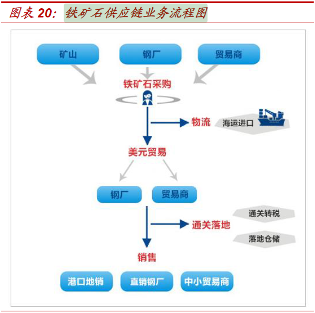  

- 铁矿石采购情况    
  我国的铁矿石来源主要依靠国产矿山自供和从国外进口两大来源，铁矿石主要依赖进口，虽然我国国产铁矿石品位较低，但由于具有一定的价格优势，仍可以满足多数中小钢厂的需求。    
 
- 铁矿石采购的定价机制：    
  总体特征：长协定价向短期定价化发展。
       
  长协定价：供需双方通过长期合同锁定供货数量或采购数量，期限一般达到5～10年，甚至达到20～30年，但其价格并不固定，通常是由重要的钢铁企业和铁矿石生产商，分别就当年的铁矿石价格广泛讨论，达成一个普遍认同的以年为单位的基准协议价格，在2010年以前，几乎每一年的基准协议价格均以铁矿石大幅上涨而告终。     
    
  指数定价：随着定价体系向短期化发展，从2010年起，三大矿山开始通过指数定价的方式，对每个季度或每个月的铁矿石价格进行调整，所使用的指数主要参考现货市场的价格走势。铁矿石指数受到更多关注。国际上已有不少机构率先推出了铁矿石价格指数，其中影响力较大的有，TSI指数、MBIO指数等，其中，Platts指数（普氏价格指数）由于被三大矿山采纳，成为季度指数定价体系基础而备受关注。2011年6月28日，普氏指数收购TSI指数，增强其在指数发布市场地位。    
  目前，国际上有三个比较通用的铁矿石定价指数分别是普氏能源资讯的普氏价格指数、世界金属导报（MetalBulletin）的MBIO指数和环球钢讯（SBB）的TSI指数。    
  2012年10月，大商所铁矿石期货已经于由证监会立项。    
  2013年10月18日，铁矿石期货合约已经在大连商品交易所上市交易。    
  2018年5月4日铁矿石期货正式实施引入境外交易者业务。    
  [我国的铁矿石长协定价历史](https://news.stcn.com/sd/202007/t20200701_2093788.html)   
  [普氏定价的利弊](https://wallstreetcn.com/articles/3630730)

- 铁矿石进口价格与国内铁矿石产量的关系    
  剔除季节性因素影响，国内铁矿石产量和进口价格具有较强的正相关性。铁矿石进口价格超过140美元/吨，则国内铁矿石产量可以充分释放，钢厂可适当减少进口矿用量，进口铁矿石价格推涨就会遇到阻力；如果铁矿石价格在120美元/吨，国内部分矿山产量会有减少，国内部分需求就不得不转向国外，需求增加国外矿山较容易提价，因此120美元/吨通常被市场认为是较有效的支撑位；如果进口铁矿石价格跌破100美元/吨，则国内很大一部分矿山无法正常生产，国内一定会增加进口来满足需求，该价格通常为铁矿石价格的下限。如今年5月底6月初，进口铁矿石价格跌到了100-110美元/吨的位置后，就止跌企稳并逐渐回升，就是由于国产矿山纷纷停产，国内钢厂纷纷增加进口铁矿石订单的缘故，后来从7月铁矿石进口量创下年内新高纪录也进一步验证了这一点。    
    
[资料来源：铁矿石定价机制及其价格影响因素](https://zhuanlan.zhihu.com/p/20225916)

- 铁矿石需求量测算公式：     
  假设铁矿石品位0.62，铁钢比0.81:1则铁矿石需求量测算公式为：    
  > 铁矿石需求量=生铁产量/0.62     
  铁矿石需求量= 粗钢产量*0.81/0.62≈粗钢产量*1.31    

 

### 钢厂销售模式
钢厂销售模式并没有固定的形式，制定各种销售模式是为了适应市场的需要更好的销售钢材，各个钢厂会根据自身情况灵活调整销售模式。以下是钢厂一般采取的销售模式。    
直销直营：钢厂直接将产品销售需求量大的终端用户，减少中间流通环节，降低用户用钢成本。    
代理及经销商模式：钢厂通过代理商或者经销商将钢材销售给用户。

    经销(经销)商类型：    
    一级经销商：俗称钢厂协议户，是指与钢厂签订了长期的购销协议，每月固定从钢厂购买大量钢材进行销售的钢材销售企业。       
    中间商：或称为二级代理商，俗称搬砖头的商家，就是不直接从钢厂进货、而是从钢厂协议户或其他中间商手中购买钢材再销售的企业。
钢厂分公司自营：钢厂通过外设分支机构（驻厂销售公司、驻外销售公司、办事处等）向终端用户销售产品。
网络销售：利用互联网电商兴起，在互联网上进行销售。互联网销售又分为钢厂自行设立销售网站、加入第三方互联网电商平台如钢银电商、找钢网等进行销售。

- 钢厂政策：    
日常政策：钢厂日常的经营时与钢贸商的协议内容。    
特殊政策：在某些特殊情况下，采取的销售的价格策略，比如冬储。    

- 销售政策的一般内容：   
收款、交货、结算方式、返利、政策时间周期、计息方式

- 具体政策内容：    
1. 收款：日常政策下，一级经销商与钢厂签了年度买卖合同，每个月需要向钢厂采购一定量的货物并按照货物支付货款，然后钢厂才进行生产、发货。当遇到冬储时，钢厂会采取在日常政策的基础上，进行特殊政策，比如针对经销商冬储货值进行预收款，一般以保证金的形式收取，但钢厂可以使收款时间延后，或者经销商提前付冬储款项钢厂给予每吨xx元的优惠，以此优惠经销商。收款方式也可以分为承兑和现汇，承兑价比现汇的价格略高。
2. 交货：钢厂向经销商交货的时间、方式。日常政策下，钢厂会根据与经销商签订年度协议，按照协议指定的时间、地点发货。冬储特殊政策时，钢厂会依据当年的春节时间逐批发货，一般在春节后一个月甚至一个半月内交货完毕。
3. 常见结算方式：
     - 结算方式一般较为灵活，没有固定的模板。钢厂会依据不同的形式制定不同的结算方式。
     - 不锁价售后结算定价模式：钢贸商先拿货，不定价，实现销售之后，按照实际成交价进行结算，钢厂在成交价的基础上，再给钢贸商xxx元/吨的收益。
     - 后结算定价模式：钢厂将钢材发给钢贸企业之后，暂时不定价，钢贸商只需向钢厂支付部分货款，或支付定金，在1周或10天之后，根据钢贸商所在地区该时间段的现货市场实际成交价格与钢贸商决定最终的结算价格。
     - 双锁价定价模式：钢贸商在与终端用户签订供货合同之时，就将钢材价格锁定。同时，钢贸商向钢厂订货，也将订货价格锁定。
     - 保量保价模式：厂商双方协商，如果全年、分月完成供需合同，供货价格就按照低于确定的地区价格一定差价进行开票结算。
     - 定价不追溯模式：厂商双方按照有关钢材网站或钢材期货及电子远期合约的某月某日的挂牌价成交均价确定下月的订货价，并确定供需数量，交割时间，价格不再追溯。
     - 货到付款，锁定价格模式：无论价格上涨还是下跌，只要厂商对于某单、某月的合同量付款确定价格，双方就应不折不扣地按时按质地交收货物，严格履行合同。
4. 返利：经销商按照一定的方式每月完成一定的提货量，钢厂给予返利xxx元/吨。
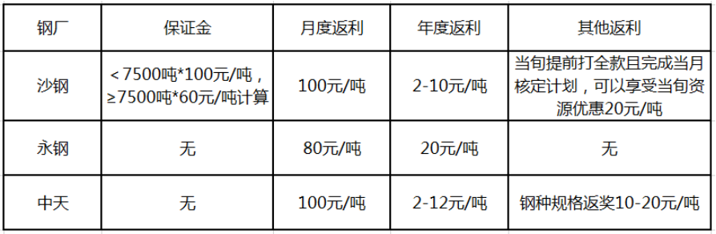  
[资料来源：沙永中钢厂相继公布2019年建材销售政策](https://robo.datayes.com/v2/details/news/52996998)
5. 政策时间周期：政策执行时间。
6. 计息方式：经销商在收款截止日前预付钢厂冬储总货款的一定保证金，保证金比例为30%-60%不等，钢厂会将最终结算前的保证金利息全部返还至经销商，以此调动经销商冬储的积极性，贴息利率越高越能调动经销商冬储的积极性。    
*《冬储积极后库存或创近5年新高期螺震荡偏弱》*   
- 冬储政策范例    
[资料来源：2021最全冬储政策出台](https://www.sohu.com/a/446288059_141885)    
[资料来源：各区域钢厂冬储政策及库存变化的背后](https://finance.sina.com.cn/money/future/fmnews/2020-01-19/doc-iihnzhha3378415.shtml?cre=tianyi&mod=pcpager_fin&loc=11&r=9&rfunc=100&tj=none&tr=9)

- 钢材定价    
2015~2021年螺纹钢现货价格走势
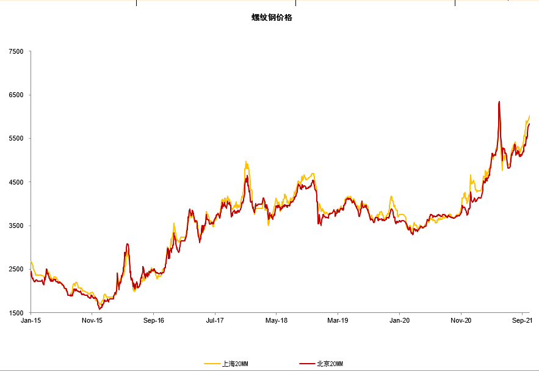  
2015~2021年冷轧现货价格走势
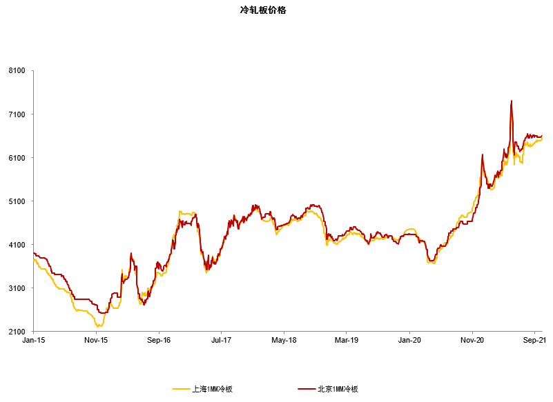  
2015~2021年热轧现货价格走势
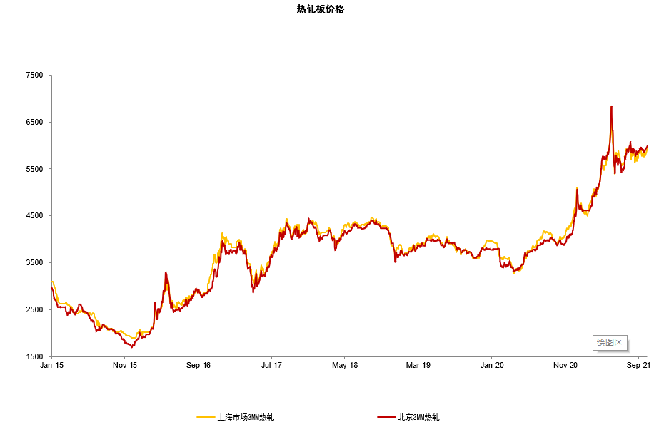  
2015~2021年中厚板现货价格走势
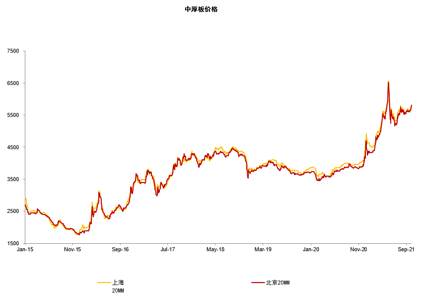 
2015~2021年生铁现货价格走势 
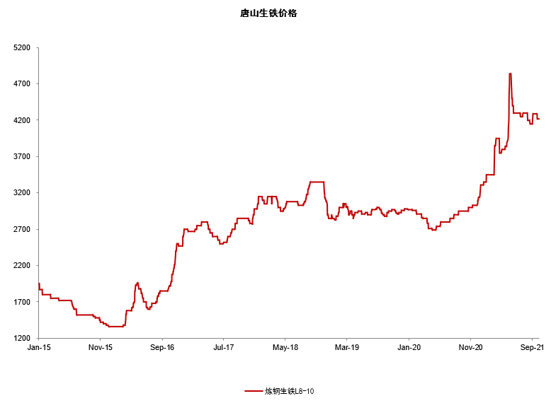  
- 钢材定价的依据     
钢厂会根据期货的价格与实际的交易情况制定出每日的钢材价格报价。影响定价的因素包括：原材料价格上涨或者下跌引起钢价的涨跌；政府政策也会短时间的调控钢价，比如限产政策，2021年10月对煤炭价格的大幅调控，使得钢价下跌；市场的局部供需状况，也会促使钢材价格变动，比如当某地的某类钢材紧缺，供给减少需求不减的情况，钢厂也会上调钢材的价格。

- 钢坯期货    
国内钢坯期货目前还没有上市，未来将准备在郑商所上市。    
境外钢坯期货：伦敦金属交易所LME钢坯期货（2008年4月28日上市）
- 钢贸交易中的术语：    
[钢贸交易中的术语](https://www.sohu.com/a/215763033_762329)

- 钢贸交易中的常见规律：
1. 北材南下    
北材南下指的是冬天由于北方天气太冷，房地产项目施工减少，北方钢厂库存压力比较大，因此北方钢材向南销售。一般销售的是螺纹钢、线材等建筑材。     
北材南下的现象需要满足两个条件：（1）冬天北方市场需求弱。去年冬天沈阳由于盘条紧缺市场需求旺盛，即便是处于冬季状态，北材南下的现象也不明显。（2）北方钢材价格与南方钢材价格形成价差，且北方钢材价格比南方价格低。去年南北方钢材价格差价有150元左右，北方长材南下意愿明显。    
2. 金九银十    
金九银十指的是钢材会在每年的九至十月份迎来一波需求旺季。    
形成金九银十现象的原因是因为钢材的终端客户比如房地产会在九月份十月份开盘、许多汽车企业也会在九、十月份开始生产准备库存，因此会在九、十月份形成一波钢材需求旺季。

### 钢铁行业碳相关政策
- 碳中和（carbon neutrality）：    
  是指国家、企业、产品、活动或个人在一定时间内直接或间接产生的二氧化碳或温室气体排放总量，通过使用低碳能源取代化石燃料、植树造林、节能减排等形式，以抵消自身产生的二氧化碳或温室气体排放量，实现正负抵消，达到相对“零排放”。    
达成碳中和的2种做法：    
透过碳补偿机制，使其产生的碳排放量，等同于在其它地方减少的碳排放量。例如：植树造林、购买再生能源凭证。    
使用低碳或零碳排的技术（参见低碳经济）。例如使用再生能源（如风能和太阳能），以避免因燃烧化石燃料而排放二氧化碳到大气中；最终目标是仅使用低碳能源，而非化石燃料，使碳的释放与吸收回地球的量达平衡不增加。    
[资料来源：维基百科](https://zh.wikipedia.org/wiki/%E7%A2%B3%E4%B8%AD%E5%92%8C)
 
碳中和相关政策：
  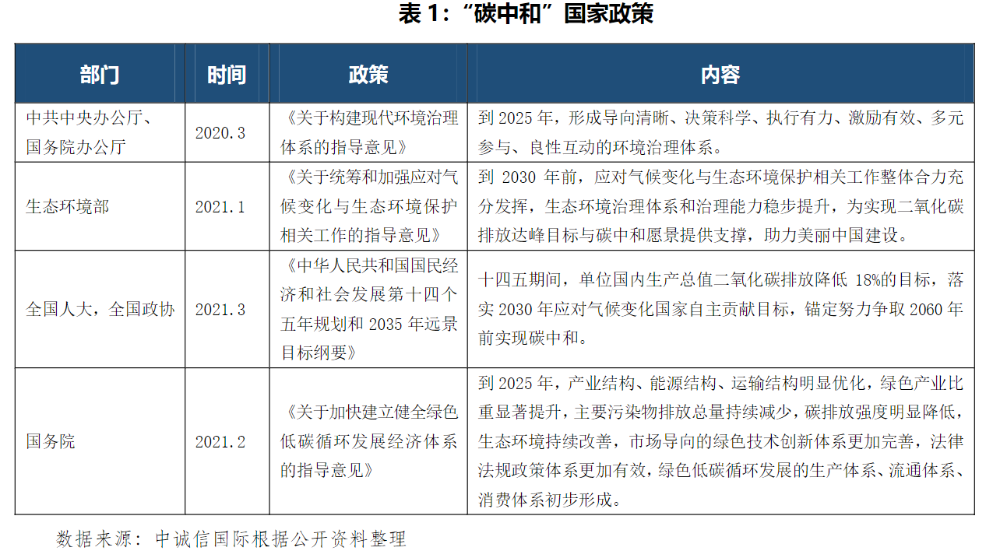  
 
其他阅读参考资料：    
[碳中和对铁矿石商的影响](http://www.chinaisa.org.cn/gxportal/xfgl/portal/content.html?articleId=f29ae9ae5dda7255ca8fa800c36d377c3814c773ede390b1fb78d54a9412cbc6&columnId=1bad7c56af746a666e4a4e56e54a9508d344d7bc1498360580613590c16b6c41)    
[中国“碳中和”政策现状与趋势分析](https://finance.sina.com.cn/esg/2021-06-17/doc-ikqciyzk0137917.shtml)

- 碳达峰（peak carbon dioxide emissions）：   
  是指在某一个时点，二氧化碳的排放不再增长达到峰值，之后逐步回落。
- 碳达峰现状：    
  政策方面，据悉《钢铁行业碳达峰实施方案》初稿已完成，方案基本明确了钢铁行业的达峰路径、重点任务及降碳潜力，同时相应的技术支撑等也有研究。”有关人士表示，钢铁行业正面临从碳排放强度的“相对约束”到碳排放总量的“绝对约束”。    
  [资料来源：钢铁行业谋划碳达峰路线图](http://www.jjckb.cn/2021-08/09/c_1310116405.htm)
  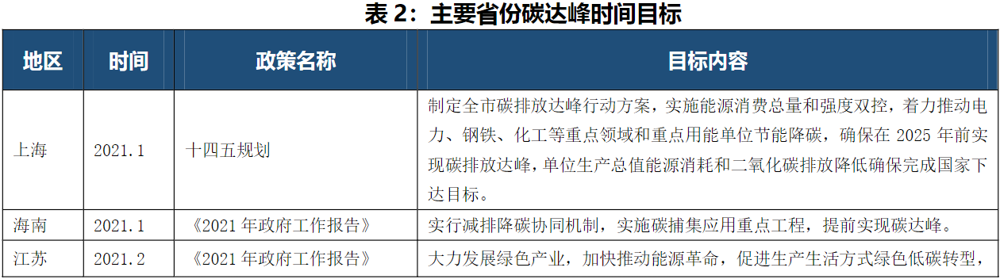  
  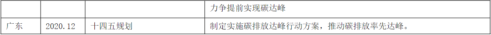
  [《关于开展重点行业建设项目碳排放环境影响评价试点的通知》生态部](https://www.mee.gov.cn/xxgk2018/xxgk/xxgk06/202107/t20210727_851553.html)    

- 钢铁行业的碳排放    
1. 碳排放量计算方法    
钢铁生产企业的CO2排放总量等于企业边界内所有的化石燃
料燃烧排放量、工业生产过程排放量及企业净购入电力和净购入热力隐含产生的CO2排放量之和，还应扣除固碳产品隐含的排放量。计算公式如下：
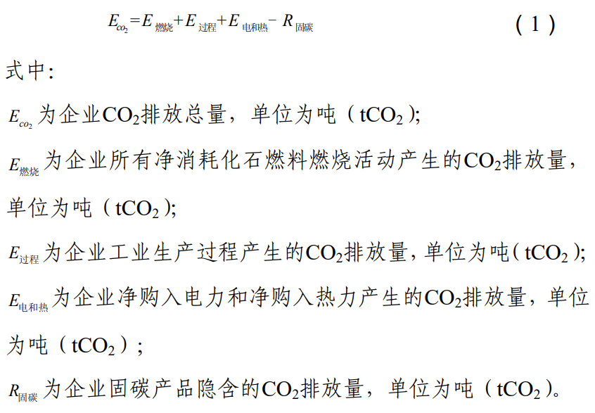  
*资料来源：《中国钢铁生产企业 温室气体排放核算方法与报告指南（试行）》*   
2. 各个环节的碳排放量占比    
根据文旭林等在《钢铁企业碳排放核算及减排研究》对长流程钢厂碳排放研究：燃料燃烧碳排放约占总排放
量94%；净购入电力碳排放约占总排放量6%（该作者是以柳钢为调研对象且调研时柳钢还自发电量，自发电量占80%左右。现在柳钢已经不自发电了，此部分碳排放量会有所增加）。工业生产过程排放：在烧结、炼钢工序中，需消耗石灰石、白云石、电极、生铁、铁合金等含碳原料，以及生产熔剂过程的分解和氧化产生的CO2排放，约占总排放量的6%。固碳产品隐含的排放：生产过程中部分碳固化在企业生产外销的粗钢、粗苯和焦油中，相应部分的二氧化碳排放应予扣除，约占总排放量的4%。    
3. 碳排放源识别表
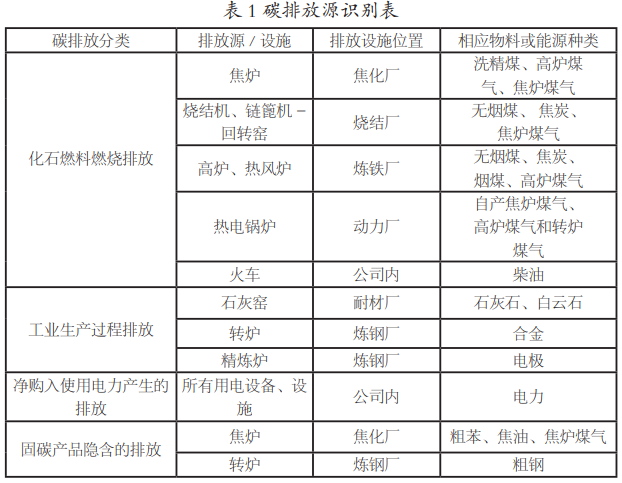  
4. 提高铁钢比对碳排放的影响    
铁钢比：指的是铁水入炉量与出钢量之比，主要影响因素有铁水入炉温度和铁水入炉量。铁钢比反映钢铁企业铁水转化成粗钢的能力。    
据统计，铁钢比每下降0.1，吨钢二氧化碳排放强度降低约130公斤。世界平均铁钢比在0.7左右，2020年马钢铁钢比为0.887、扣渣后0.878的历史最佳水平。    
*资料来源：《钢铁企业碳排放核算及减排研究》*

- 环保限产    
  钢铁、有色、石化、化工、建材等重点行业，以年综合能源消费量5000吨标准煤以上的工业企业为重点，结合节能监察、能源审计等工作中发现的问题，全面实施节能诊断。     
  以年综合能源消费量5000吨标准煤以下、能源管理基础相对薄弱的中小型工业企业为重点，深入开展节能诊断。    
  [工业和信息化部办公厅关于组织开展2021年工业节能诊断服务工作的通知](https://www.miit.gov.cn/zwgk/zcwj/wjfb/zh/art/2021/art_9a9335f8819743619060b5ac5d9c3e28.html)    
  相关政策：
  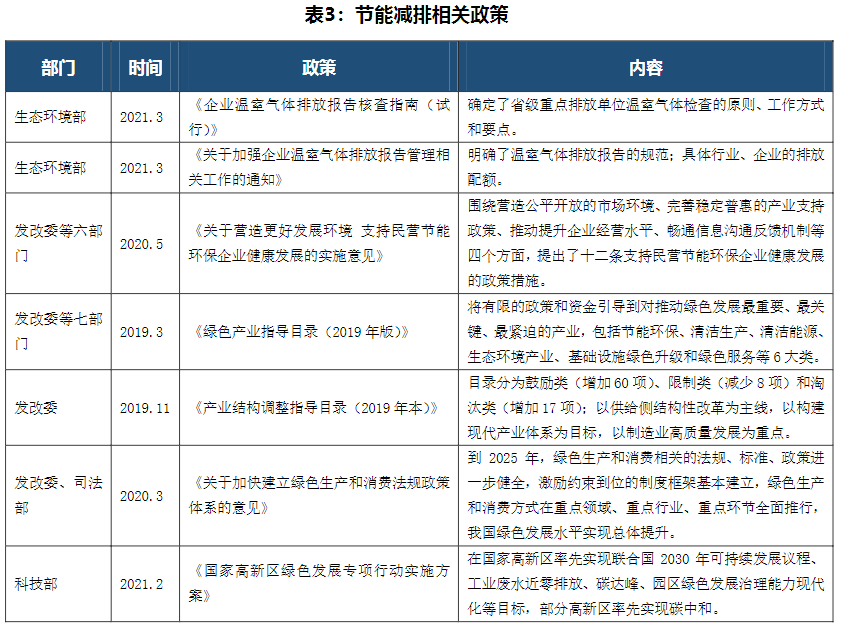    

- 供给侧改革    
  相关政策：    
  [《国家发展改革委办公厅工业和信息化部办公厅关于完善钢铁产能置换和项目备案工作的通知》](https://www.waizi.org.cn/doc/76197.html)    
  [深化供给侧结构性改革 促进钢铁行业高质量发展——《关于完善钢铁产能置换和项目备案工作的通知》解读](https://www.ndrc.gov.cn/xxgk/jd/jd/202001/t20200123_1219770.html?code=&state=123)   

- 观点小结：     
不同的钢厂自身在钢铁行业未来的发展方向是不一样的，国内龙头企业未来更注重国际市场占有率，实现收入增长二进阶；由于制造业转型升级，国内特钢需求增加，特钢企业也将迎来一次增长；普钢企业的增长方向主要在于控制成本与把握区域供需格局。   
上述内容更着重于普钢企业在成本把控，以及影响成本的一些因素，包括生产成本因素与外部环境发展而硬气的一些成本变化。