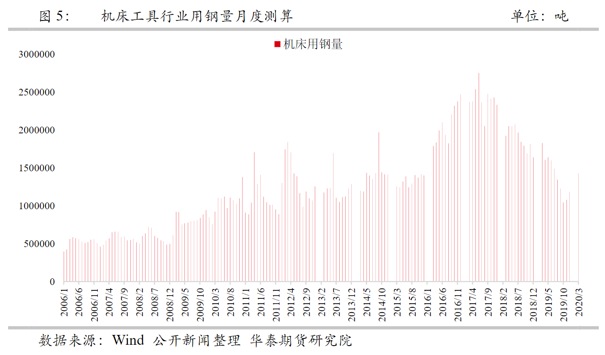
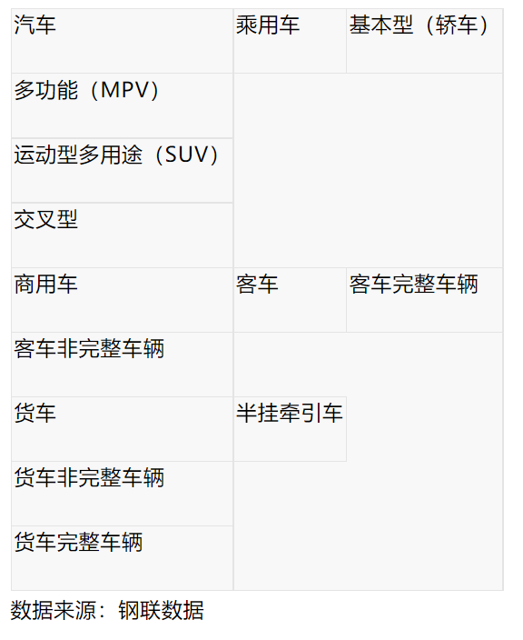
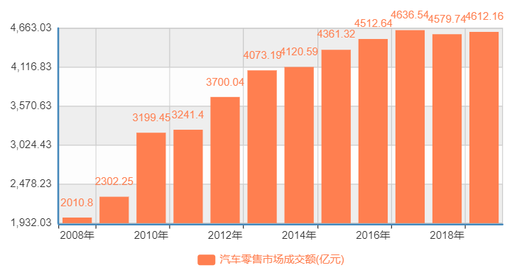

### 区域需求
- 各个终端需求用钢量占总体钢材比重    
  
  

### 房地产需求
- 房屋类型：
  1. 住宅：指专供居住的房屋，包括别墅、公寓、职工家属宿舍和集体宿舍(包括职工单身宿舍和学生宿舍)等。但不包括住宅楼中作为人防用、不住人的地下室等。
  2. 办公楼：指企业、事业、机关、团体、学校、医院等单位使用的各类办公用房(又称写字楼)。
  3. 商业营业用房：指商业、粮食、供销、饮食服务业等部门对外营业的用房，如度假村、饭店、商店、门市部、粮店、书店、供销店、饮食店、菜店、加油站、日杂等房屋。
  4. 其他：凡不属于上述各项用途的房屋建筑物，如中小学教学用房、托儿所、幼儿园、图书馆、体育馆等。   
 

- 各类型房屋新开工面积（万平方米）    
房屋总体新开工面积与房屋中住宅类型的新开工面积的趋势基本相同，且住宅类型的新开工面积占房屋总体开发面积的比重最大，说明在房地产需求中，住宅类型的房屋需求占了整体房地产需求的大部分。
  
统计解释：指房地产开发企业报告期内新开工建设的房屋面积，以单位工程为核算对象。不包括在上期开工跨入报告期继续施工的房屋建筑面积和上期停缓建而在本期复工的建筑面积。房屋的开工以房屋正式开始破土刨槽（地基处理或打永久桩）的日期为准。房屋新开工面积指整栋房屋的全部建筑面积，不能分割计算。    
[资料来源：国家统计局](https://data.stats.gov.cn/search.htm?s=%E6%88%BF%E5%B1%8B%E6%96%BD%E5%B7%A5%E9%9D%A2%E7%A7%AF)    
  
与螺纹钢的价格走势对比发现，在2014年至2015年，住宅的新开工面积曾经大幅下跌，与建筑所需的螺纹钢的价格走势，对比发现螺纹钢的价格也在2014年至2015年之间大幅下跌，直到2016年新开工面积新增，螺纹钢价格才逐步回升，初步可以将新开工面积走势与螺纹钢的价格走势相结合。
- 房屋施工面积（万平方米）    
从图上可以看出2007年至2013年期间施工面积快速增长，2013年以后施工面积虽然仍在增加，但已经增速停滞或者放缓。
  
统计解释：房屋施工面积指报告期内施工的全部房屋建筑面积。包括本期新开工的面积、上期跨入本期继续施工的房屋面积、上期停缓建在本期恢复施工的房屋面积、本期竣工的房屋面积以及本期施工后又停缓建的房屋面积。多层建筑应填各层建筑面积之和。    
[资料来源：国家统计局](https://data.stats.gov.cn/search.htm?s=%E6%88%BF%E5%B1%8B%E6%96%BD%E5%B7%A5%E9%9D%A2%E7%A7%AF)

- 房地产开发企业本年购置土地面积(万平方米)     
与房屋施工面积图对比发现2004~2013是房地产开发企业购置土地面积的高峰期，同时也是房屋施工面积的快速增长期。2016年以后，房地产开发企业购置土地面积减少，房屋施工面积也随之缓慢增长。
  
统计解释：指房地产开发企业在本年内通过各种方式获得土地使用权的土地面积。

- 35个大中城市本年购置土地面积(万平方米)     
  
*数据来源：国家统计局*

- 房屋销售面积(万平方米)    
  
统计解释：指报告期内出售新建商品房屋的合同总面积（即双方签署的正式买卖合同中所确认的建筑面积）。该指标是累计数据。    
*数据来源：国家统计局*
 

- 房屋基建使用钢材类型    
  
[资料来源：三钢闽光2020年度报告](http://data.eastmoney.com/notices/detail/002110/AN202104221487069232.html)
 

- 房屋每平米用钢量预估（以下住宅按抗震7度区规则结构设计）
1. 多层砌体住宅：钢筋30KG/㎡（偏多）
2. 多层框架：钢筋38—42KG/㎡    
3. 小高层11—12层：钢筋50—52KG/㎡  
4. 高层17—18层：钢筋54—60KG/㎡   
5. 高层30层H=94米：钢筋65—75KG/㎡
6. 高层酒店式公寓28层H=90米：钢筋65—70KG/㎡  
7. 别墅用钢量介于多层砌体住宅和高层11—12层之间，28层的框支剪力墙结构建筑，有一层地下室，一层裙房，基础是伐型基础，平均大概在80-100KG/㎡。    
8. 高层----框剪结构    
对8度，三类场地： 70~75公斤；    
对8度，二类场地： 60~65公斤；   
对7度，三类场地： 60~65公斤；      
对7度，二类场地： 50~55公斤；     
对6度，二类场地： 40~45公斤；     
对6度，三类场地： 45~55公斤；    
[资料来源：一般情况下平米钢筋含量示例](360doc.com/content/18/1221/16/28979417_803393869.shtml)
- 总结：    
从钢贸的角度来看，房地产无疑是钢材的重要出口行业。房屋新开工面积、施工面积、房地产开发企业本年购置土地面积，均属于滞后性的指标，只能反映报告期内房地产需求的总体状况，却不是实时状况。对于关注下游的房地产市场需求实时状况，需要更加关注房地产行业的运转过程中的一些数据指标，比如房地产限贷政策、货币政策、土地出让金、限制炒房、房地产企业资金周转率等。
### 基础建设
- 广西、广东、上海、成都、重庆2021年重大投资项目清单
1. [广西柳州市2021年市级重大项目清单](https://www.sohu.com/a/459703721_120052105)
2. [南宁重大项目2021](https://www.sohu.com/a/479667737_120534254)
3. [广西公布2021年第一批重大项目](http://www.360doc.com/content/21/0117/22/7863900_957511348.shtml)
4. [广东省2021年重点建设项目计划](http://drc.gd.gov.cn/ywtz/content/post_3253184.html)
5. [2021年上海市重大建设项目清单](https://www.shanghai.gov.cn/nw48306/20210207/2779194d1ea3498bb432c42fd957f56b.html)
6. [成都重大项目2021(未公布详细名单)](http://cddrc.chengdu.gov.cn/cdfgw/c114135/2021-02/19/content_690e66b32ccc4234aed0c647df796971.shtml)
7. [重庆重大项目2021](http://www.cq.gov.cn/zwgk/zfxxgkzl/fdzdgknr/zdxm/zdxmqd/202103/t20210310_8982635.html)

- 基础设施基本情况

1. 城市桥梁数目（座）：
除了2011年至2012年桥梁数目增长有比较明显的提升外，2012年以后，桥梁每年增长两千多座，增长较为稳定。
  
统计解释：城市桥梁是指为跨越天然或人工障碍物而修建的构筑物。包括跨河桥、立交桥、人行天桥以及人行地下通道等。
1. 道路面积与长度    
  
统计解释：道路面积是指道路实际铺装面积和与道路相通的广场、桥梁、隧道的铺装面积（统计时，将人行道面积单独统计）。人行道面积按道路两侧面积相加计算，包括步行街和广场，不含人车混行的道路。    
道路长度是指道路长度和与道路相通的桥梁、隧道的长度，按车行道中心线计算。
3. 新建铁路投产里程建设规模、新建公路建设规模、改建公路建设规模历史数据

*数据来源：国家统计局*  

- 基建用钢类型

1. 铁路：根据牌号识别。
  
*资料来源：《铁路桥梁用钢结构 TBT 3556-2020》*
2. 桥梁用钢：根据牌号识别。
  
[资料来源：桥梁用钢结构](https://www.doc88.com/p-6107800849861.html)

- 基建用钢量测算

1. 铁路：铁路建设每投资一亿元，将平均消耗钢材0.333万吨。笼统推算，城市轨道交通建设每投资一亿元，将拉动钢材消费一万吨左右（包括车站、设备等）
2. 机场建设：每投资10亿元约消耗1万多吨钢材。
3. 公路：耗钢量约为400-500t/km，以中间值450吨测算。
4. 港口建设：建一个混凝土港口泊位需耗钢1000吨左右，加上中转耗材不会超过2000吨；而修建一个钢柱港口泊位需耗钢量将很大，若含8%堆场，仓库的用钢量，最后得出修建一个泊位平均用钢约2500吨。
 以上的钢材需要量均方船舶的设计用量，未考虑钢材的实际利用率。    
[资料来源：一图揭晓各行业用钢量测算！](http://www.ecorr.org/news/science/2019-06-20/174321.html)

### 制造业

- 机械行业分类    
我国广义机械
工业共分为13 个大行业，126 个小行业，13个大行业分别是农业机械、内燃机、工程机械、仪器仪表、文化办公设备、石油化工通用机械、重型矿山机械、机床工具、电工电器、机械基础件、食品包装机械、汽车工业、其他民用机械等。    
- 高耗钢的八大机械子行业：    
主要为机床、石化通用、工程机械、重型矿山、电工电器、农机、基础件、其他设备行业(集装箱、电梯)。
- 机械行业主要使用钢材种类
  
  
 1](images/1b9826a40dffc2011f0e15b174150db2e428be5436a7f457e5272685b3481018.png)  

[资料来源：三钢闽光2020年度报告](http://data.eastmoney.com/notices/detail/002110/AN202104221487069232.html)
- 各机械行业用钢量测算
  
  
  
  
  
  
  
  
[资料来源：《机械行业用钢量分析及展望》](https://robo.datayes.com/v2/details/report/4231688)
 

- 汽车分类（按车型）   
  

- 汽车用钢数量测算及类型：    
平均每辆汽车用钢900千克，汽车用钢分布如下：   
40%的钢材用于车身结构、钣金、车门和行李箱，以获得高强度，以及在发生碰撞时吸收能量。    
23%的钢材用于传动系统，包括发动机组使用的铸铁，以及耐磨齿轮机构使用的可切削碳钢。    
12%的钢材用于悬挂系统，使用的是高强度轧制钢带。   
其余钢材出现在车轮、轮胎、油箱、转向和制动系统。   
具体使用钢的类型根据牌号。   
[资料来源：世界钢铁协会](https://www.worldsteel.org/zh/steel-by-topic/steel-markets/automotive.html)    
1. 汽车大梁用钢
  
[资料来源：汽车大梁用热轧钢板和钢带](https://www.doc88.com/p-49559964261554.html)
2. 汽车车轮用热轧钢板和钢带
  
[资料来源：汽车车轮用热轧钢板和钢带](https://www.doc88.com/p-7794821804601.html)
3. 车轮轮辋用热轧型钢
  
[资料来源：车轮轮辋用热轧型钢](https://www.doc88.com/p-6941781957084.html)
4. 传动轴用电焊钢管
  
[资料来源：传动轴用电焊钢管](https://www.doc88.com/p-40029072213138.html)

- 汽车存量情况
1. 私人汽车拥有量
2020年我国私人汽车保有量24285.17万辆。
  
*数据来源：中国国家统计局*    
统计解释：私人车辆拥有量指报告期末在公安交通管理部门注册登记并领有本地区私人车辆牌照的汽车数量。根据汽车大小规格不同，载客汽车分为大型、中型、小型和微型，载货汽车分为重型、中型、轻型和微型。
2. 千人汽车拥有量    
2020年我国千人汽车拥有量：204辆。以下为：2019年全球20个主要国家千人汽车拥有量数据。
  
[数据来源：潜力无限？ 中国千人汽车拥有量仅173辆](http://www.caam.org.cn/chn/8/cate_82/con_5225482.html)
3. 我国大中城市汽车保有量情况    
至2020年底，全国共有70个城市的汽车保有量超过百万辆，同比增加4个城市。31个城市超过200万辆，13个城市超300万辆。汽车保有量前10的城市分别是北京、成都、重庆、苏州、上海、郑州、西安、武汉、深圳和东莞。其中，北京、成都和重庆三个城市汽车保有量超过了500万辆。据北京市公安交通管理局统计截止至2021年8月，北京汽车保有量已经达到677万辆。北京千人汽车拥有量274辆。    
31个城市汽车普及率表：    
  

4. 汽车库存指数
   
统计解释：以50%作为荣衰线，50%以下处于合理的范围。库存预警指数越高，反应出市场的需求越低，库存压力越大，经营压力和风险越大。    
*数据来源：中国汽车流通协会*
  
统计解释：库存系数在0.8~1.2之间，反映库存处在合理范围。库存系数＞1.5，反映库存到达警戒线，需要关注。库存系数＞2.5，反映库存过高，经营压力和风险都非常大。    
*数据来源：中国汽车流通协会*
 

- 汽车产量情况    
1. 汽车产量总体概览     
  
*数据来源：国家统计局*
2. 轻型商用车、客车历年产量（辆）    
  
*数据来源：中国汽车工业协会*
3. 汽车进口    
  
*数据来源：国家统计局*
 

- 汽车需求情况
1. 汽车零售市场成交额    
  
*数据来源：国家统计局*
2. 汽车总销量、乘用车销量、商用车销量（辆）
 
 *数据来源：中国汽车工业协会*
3. 汽车销售指数
  
*数据来源：中国汽车流通协会*
 

- 总结：    
从汽车的主要需求是私人乘用车，以北京作为参考粗略推算出250辆~280辆的千人汽车拥有量为汽车市场饱和点。2017年以后，汽车市场成交额增长已经非常缓慢。整个汽车行业总体来看需求是不断在下滑的。    

- 汽车行业用钢需求量    
1. 每量汽车用钢量测算    
测算方式1：    

[资料来源：一图揭晓各行业用钢量测算！](http://www.ecorr.org/news/science/2019-06-20/174321.html)    
测算方式2：
  
[资料来源：Mysteel参考丨“拆解”汽车车型看汽车用钢变化](https://finance.sina.com.cn/money/future/indu/2020-09-21/doc-iivhuipp5552131.shtml)
2. 汽车车身分车型的品种用钢占比
  
[资料来源：Mysteel参考丨“拆解”汽车车型看汽车用钢变化](https://finance.sina.com.cn/money/future/indu/2020-09-21/doc-iivhuipp5552131.shtml)

### 船舶    
- 船舶主要使用钢材类型    
船体结构钢特指按船级社建造规范要求生产的用于制造船体结构的钢材。依据最小屈服强度，中国船级社(China Classification Society, CCS)将船体结构钢划分为不同的级别，包括一般强度船体结构用钢(屈服强度不小于235 MPa)、高强度船体结构用钢(分三个强度级别，屈服强度分别不小于315 MPa、355 MPa和390 MPa)和焊接结构用高强度淬火回火用钢(分六个强度级别，屈服强度分别不小
于420 MPa、460 MPa、500 MPa、550 MPa、620 MPa和690 MPa)。    
*资料来源：《超高强度船体结构钢焊接性的研究现状和趋势》*    
- 船用钢具体牌号：
1. 船舶及海洋工程用结构钢
  
[资料来源：船舶及海洋工程用结构钢](https://www.doc88.com/p-9196172143700.html)
2. 船舶用碳钢和碳锰钢无缝钢管
  
[资料来源：船舶用碳钢和碳锰钢无缝钢管](https://www.doc88.com/p-4834775057875.html)
3. 热轧球扁钢（仅ABDE）
  
[资料来源：热轧球扁钢](https://www.doc88.com/p-7304822353600.html)

 

- 国际船级社    
1. 美国船级社 ABS American Bureau of Shipping     
2. 法国验船协会 BV Bureau Veritas     
3. 中国船级社 CCS China Classification Society 
4. 挪威船级社 DNV GL Det Norske Veritas Germanischer Lloyd(由两创始成员DNV(挪威船级社)与GL(德国劳氏船级社)于2013年9月合并)
5. 韩国船级社 KR Korean Register of Shipping 
6. 英国劳氏船级社 LR Lloyd's Register 
7. 日本海事协会 NK Nippon Kaiji Kyokai (ClassNK) 
8. 意大利船级学会 RINA Registro Italiano Navale 
9. 俄罗斯海事船级社 RS Russian Maritime Register of Shipping 
10. 波兰船级社 Polski Rejester Statkow (PRS) 
11. 印度船级社 IRS Indian Register of Shipping 
12. 克罗地亚船舶登记局 CRS Croation Register of Shipping (Croatian: Hrvatski registar brodova) 

- 船舶供给情况
  
  
 1](images/d2bd5fcc0d78e6c0fc166ee737005fc752898da3db90e4c07ade27c303fb3cc1.png)  
*数据来源：国家统计局*

- 船舶需求情况
1. 新承接出口船舶订单（艘）
  
*数据来源：中国船舶工业年鉴*
2. 新承接船舶订单（艘）
  
*数据来源：中国船舶工业年鉴*
3. 造船三大指标
  
[资料来源：中国船舶工业行业协会](http://www.cansi.org.cn/cms/document/10854.html)

- 船用钢量测算    
造船行业需求的钢材主要包括板材、型材和管材，其中以板材为主。造船用板材全部要取得船级社认可，其中基本上是中厚板，少量的薄板主要用在船舶的上层建筑。船舶类型差异及吨位大小不同，所消耗钢材的数量差别很大。
   - 货轮：制造一艘12000载重吨的货轮需要钢材3600吨，25000载重吨散货轮需钢材5300吨，66000载重吨散货轮需钢材11000吨。
   -  油轮：建造一艘10万载重吨油轮需要钢材16000吨，20万载重吨油轮需24000吨钢材，30万载重吨油轮需钢材40000吨。    

- 近三年造船板价格走势    
  
[资料来源：Mysteel：造船板市场分析](https://gc.mysteel.com/21/0325/16/82CDCEA566A3987D.html)

### 家电
- 主要用钢家电及用钢量    
家电行业产品中大家电产品用钢材约占90%左右，小家电用钢约占10%，板材则占全部钢材消耗的95%。平均洗衣机用21kg/台，冰箱用34kg/台，空调30kg/台。
- 家电需求量测算    
  
  
  
[资料来源：2021年家电行业用钢量测算—— 上半年高开低走，下半年稳步回升](https://news.mysteel.com/21/0918/19/C594E9494B49C7E7.html)

- 观点小结：   
了解终端需求，了解不同终端需求及其重点需要关注的数据指标，最终的目的是为了在钢贸交易中更具主动性并获取利润。在收集各方终端需求关注数据指标时，发现上述指标更侧重于展示每个终端的一般需求规律而非为了现实交易提供实时决策依据。现实交易的数据指标需求除了需要对一般需求规律的了解，也需要对实时的一些环境数据了解，才能最终为某一次交易服务。     
之所以现实交易会有一般需求规律性的指标与实时数据指标两种数据混在一起，最根本的原因在于现实交易需求中，除了面向终端用户的真实需求，也有投机需求存在。真实需求是以一般需求规律数据指标为基础的，投机需求则是以市场情绪波动，甚至加剧市场情绪波动的数据指标为操作基础。真实需求与投机需求的数据指标又并非互相割裂，投机需求的情绪指标影响了市场情绪波动，在短时间内亦有可能抑制或加强真实需求，反之亦然。    
那么哪一些数据指标属于反馈市场真实需求，而哪些数据指标更据情绪性，以房地产需求为例，新开工面积、用钢量测算更反映真实需求，有关部门关于房地产的限购政策、房贷款的抑制政策则更据情绪性。